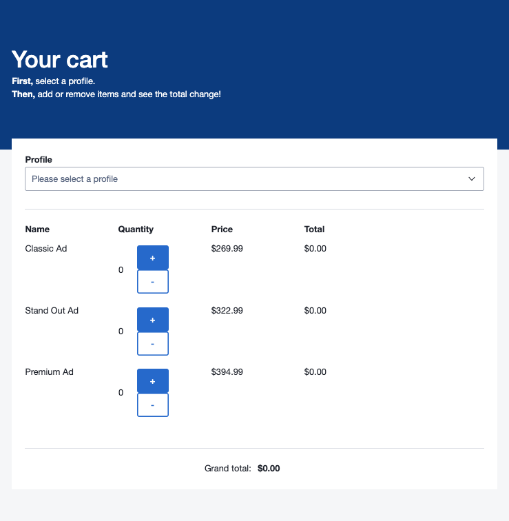
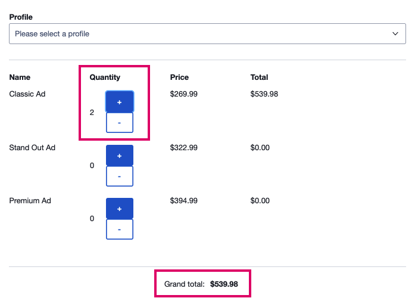
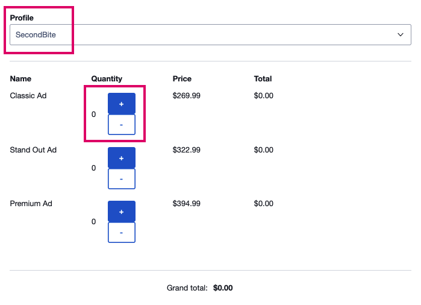
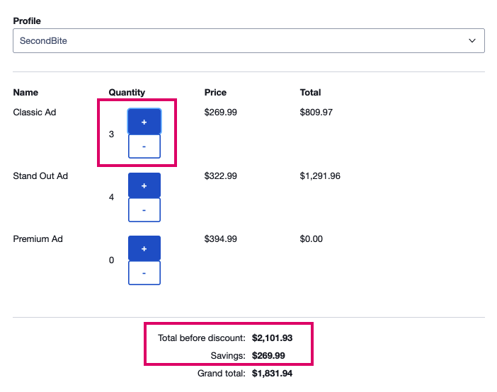

# Developer notes

## How to preview the app
[Preview on Netlify](https://jolly-feynman-1d340e.netlify.app/apac/index.html)!

## How to run the app locally
- In your terminal, navigate to the root directory of the repo
- `npm i`
- `npm run start`
- In your browser, navigate to [http://dev.apac.com:8080/](http://dev.apac.com:8080/)
    - See [sku](https://seek-oss.github.io/sku/#/./docs/getting-started) for more details

## How to use the app
1. Once you have navigated to the local server successfully ([http://dev.apac.com:8080/](http://dev.apac.com:8080/)), the below screen will be shown:

Notice the features:
    - A profile selector
    - The order summary, containing
        - Each item, with quantity controls to increase or decrease quantities
    - Grand total (possibly including details on savings, if the customer qualifies!)
1. Without selecting a profile, you will be able to update your cart as a default user with no special pricing rules applied.

1. When changing profiles using the profile selector at the top, cart item quantities will be reset to 0.

1. SecondBite happens to be one of our customers who qualifies for special pricing on Classic Ads - buy 3 for the price of 2! The applicable savings and subsequent total will be displayed at the bottom.

## Assumptions
- The app shown covers the front end of the project only; there is no back end presently
- Only a 'checkout' style page is provided without product pages
- The profile selector is for demonstration purposes only to apply the relevant special pricing rules
- Product quantities cannot go below 0
- A maximum of one type each of `discount` or `bogo` for special pricing rules can be applied for each product on each customer, for example:
    - VALID: SecondBite gets a 3 for 2 deal on Classic Ads
    - INVALID: SecondBite gets a 3 for 2 deal on Classic Ads, and also gets an 11 for 9 deal on Classic Ads

## Technology stack
- [React]()
    - 
- [Typescript]()
    - Ensures cleaner code with type checking
- [sku](https://seek-oss.github.io/sku/)
    - Seek's front-end development toolkit
    - Integrated with Braid, Seek's design system
    - Out-of-the-box styled, modular, and reusable components
- Testing
    - **NOTE:** Using *sku*, the test suite couldn't run*. For working tests that apply to the very same components and functionality (the only difference being without *sku* and [Braid](https://seek-oss.github.io/braid-design-system/) styling), please `git checkout cra-test` and run `npm run test`.
    - [Jest]()
    - [Enzyme]()
- Tooling
    - [npm]()
    - [Netlify]()
        - Easy-to-set-up automated build and deploy from GitHub repos

\* When running `npm run test`, the error returned is `No treat theme provided`. This error can be replicated on the `sku-test` branch (`git checkout sku-test`).

## To-do

### MVP
- ~~Basic page~~
- ~~Components~~
- ~~Interactive components functionality~~
    - ~~Profile select~~
    - ~~Cart quantities and subtotal~~
    - ~~Grand total~~
    - ~~Profile special pricing~~
- ~~UI tests~~
- ~~Logic/functionality tests~~ **NOTE:** Please `git checkout cra-test` for tests! (See *Technology stack: Testing* section)
- ~~Basic styling~~
---
### Make it spicy 🌶
- ~~Fix up `TODO`s~~
- ~~Better styling, leveraging [Braid](https://seek-oss.github.io/braid-design-system/)~~

## Future improvements
- Make product listings and profiles/customers more scalable
    - Would likely utilise a back end with database
- Add product listings and 'separate' cart
- Populate product listings from a JSON 'inventory' of products
    - Or better yet, a true database
- Advanced special pricing rules
    - What if the 'BOGO' type rule can be applied across products, e.g.: 'Buy 2 Classic Ads, get 1 Stand Out Ad free'?
- Maintain cart quantities and reassess totals (including discounts) when changing profiles
    - This is an unlikely real-life scenario, but better UX for testing purposes

## Resources
- [Create React App](https://reactjs.org/docs/create-a-new-react-app.html)
    - Quick and basic React app setup
- [Adding Typescript to CRA](https://create-react-app.dev/docs/adding-typescript/)
- Solving issues with using TS with React
    - ['No overload matches this call'](https://stackoverflow.com/questions/58449813/react-typescript-error-no-overload-matches-this-call)
        - The component must have an interface that includes the prop being passed
    - ['Property 'value' does not exist on type 'Readonly<{}>'](https://stackoverflow.com/questions/47561848/property-value-does-not-exist-on-type-readonly)
        - The App's class definition needs to include default types for state and props
        - Bad: `React.Component`
        - Good: `React.Component<{}, {profile: string}>`
- [Updating a value in an array of objects](https://medium.com/javascript-in-plain-english/react-updating-a-value-in-state-array-7bae7c7eaef9)
    - Used when updating specific values in the `items` array of objects
- [Formatting a number as currency](https://developer.mozilla.org/en-US/docs/Web/JavaScript/Reference/Global_Objects/Number/toLocaleString)
    - Used in `formatPrice()`
- [sku, front-end development toolkit](https://github.com/seek-oss/sku)

### Styling
- [Braid Design System](https://seek-oss.github.io/braid-design-system/)
- [Medium article on the Seek design system](https://medium.com/seek-blog/sketching-in-the-browser-33a7b7aa0526)
- ~~[Seek Style Guide](http://seek-oss.github.io/seek-style-guide/)~~ Deprecated!
- ~~[seek-style-guide GitHub page](https://github.com/seek-oss/seek-style-guide)~~ Deprecated!
